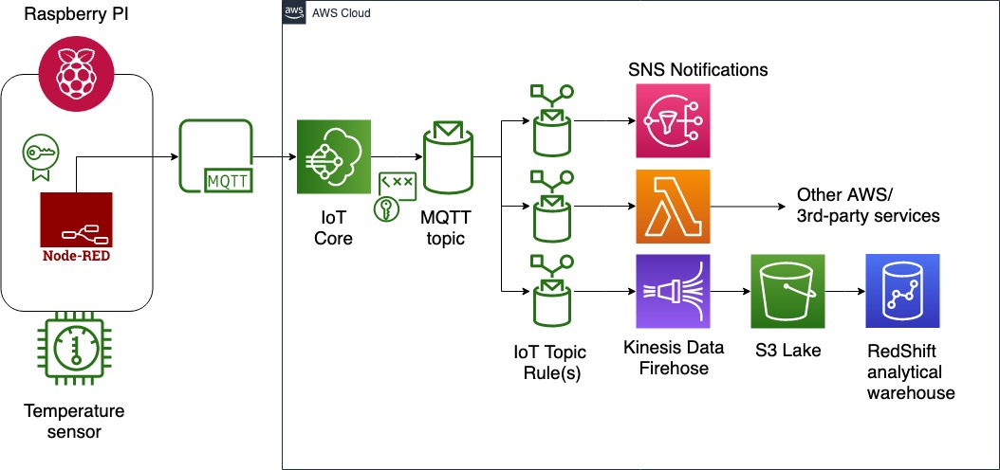

## Welcome to David's github profile

David is a cloud-native data engineer and IoT developer, experienced in building data pipelines on the AWS platform. Originally a DNA sequencing bioinformatician, he's discovered the joys of automating data pipelines that connect the physical and digital world. Lego expert.

https://hochoy.github.io/profile/

### Languages and Frameworks

Most of my work is connecting data sources to processing and final outputs or to trigger events in a system. Therefore, I've focused on these languages and frameworks:

Languages and frameworks:

For work:
- Javascript (Node.js, GraphQL, some React)
- SQL

For grad school and data analyses:
- R (tidyverse, httr, Rselenium, caret, shiny, lubridate)

For fun/plumbing:
- python (math-y packages)
- bash (IoT, devices and cli's)
- C# (Unity 3D)

#### Sample Node.js microservice data flow:

```markdown
**A microservice that queries data from Postgres and GSheets and spits out a pdf report**

const { Pool } = require('pg');                             //postgres connections
const GoogleSpreadsheet = require('google-spreadsheet');    //easy connection to gsheet, not official pkg from goog
const { promisify } = require('util');                      //convert callbacks to promises
const crypto = require('crypto');                           //de/encrypting data
const moment = require('moment');                           //manipulating time
const fs = require('fs');                                   //access filesystem
const {execSync} = require('child_process');                //run processes such as bash scripts/commands
const {parse} = require('path');                            //extract parts of a filepath
const {S3} = require('aws-sdk');                            //access aws S3 service
const carbone = require('carbone');                         //write json data into .odt file
const {google} = require('googleapis');                     //access google drive (and sheet too) via google api

**Task flow**:
RDS -> pg-pool(query) -> crypto (decrypt) -> moment (+time data) -> carbone (write odt) -> execSync (convert to pdf and zip using child_process) -> S3 (store pdf) -> google (write to gdrive)


```

### Cloud Architecture

I also like designing cloud architecture. AWS is my preferred platform as it has a diverse set of lego-like components that easily connect.

Experience with  these AWS Services and concepts:
- Lambda (Runtime layers, Cron/Event triggers)
- RDS (Read replica), DynamoDB
- EC2 (Security groups, VPCs, Subnets, NAT)
- S3
- API Gateway (Access policy)
- IoT Core (object, shadows, pub-sub, certificates and policy)
- RedShift

#### Sample IoT data flow on AWS:



### Projects and interests

Some of my past projects:
- DNA Sequencing of patient populations (Masters thesis) [Link](https://open.library.ubc.ca/cIRcle/collections/ubctheses/24/items/1.0371254)
- Collecting and analyzing IoT data from sensors placed on elevators (Consulting project with TSBC)  [Link](https://www.technicalsafetybc.ca/safety-data/iot-elevating-safety)
- Crowdsourcing data on energy usage and safety across rural communities (Consulting project with TSBC)  [Link](https://www.technicalsafetybc.ca/blog/determining-state-safety-bcs-remote-grid-communities)
